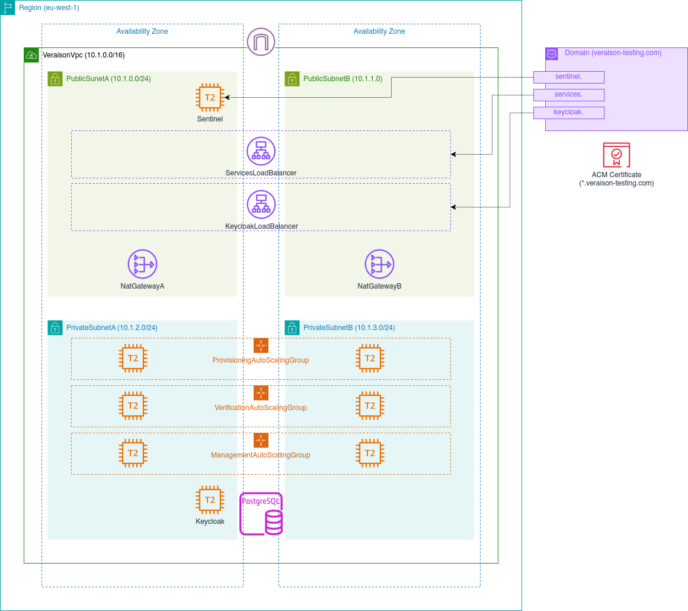

This directory contains scripts and other resources for instantiating a
Veraison deployment in AWS. The deployment is a CloudFormation stack with a
node running Veraison services, another node running Keycloak authentication,
and an RDS Postgres instance serving as the key-value store.

## Dependencies

This deployment depends on the `debian` deployment (which, in turn, depends on
the `native` deployment). Please see [its
README](../debian/README.md#dependencies) for the dependencies list.

Additionally, the following dependencies are required specifically for AWS deployment:

- `curl`: used to transfer the Debian package to the EC2 node.
- `openssl`: used to generate TLS certs (note: unlike with `native` deployment,
  where pre-generated certs may optionally be used, cert generation is mandatory
  for this deployment, as the certs must be specific to the created EC2 instance).
- `packer`: used to build AMI images using temporary EC2 instances.
- `psql`: Postgres client used to initialise the stores (may be packaged on its
  own or as part of `postgres`, depending on the platform).
- A number of Python packages used by the deployment script. Please see
  [requirements.txt](misc/requirements.txt) for details.

`curl` and `openssl` should be available from your OS's package manager. Python
dependencies are installable via `pip`/`PyPI`. For `packer`, please see [its
documentation](https://developer.hashicorp.com/packer/tutorials/aws-get-started/get-started-install-cli).
             
### Bootstrap

To simplify dependency installation, the deployment script implements bootstrap
for Arch, Ubuntu, and MacOSX (using [homebrew](https://brew.sh)). 

```bash
git clone https://github.com/veraison/services.git
cd services/deployments/aws

make bootstrap
```

(this will only work on the above-mentioned platforms).

### AWS account

You need an existing AWS account, that has at least one VPC with at least two
subnets (at least one of which is public) configured.

Please see [boto3
documentation](https://boto3.amazonaws.com/v1/documentation/api/latest/guide/credentials.html)
for how to configure `aws` CLI to access this account.

### Domain and certificate

Finally, you need a domain registered in Route53, with a corresponding
certificate created in ACM. If you already have a domain with a different
registrar, you will need to transfer it to Route53.

The certificate MUST cover subdomains as well. For example, if you have
registered `my-domain.com` in Route53, the certificate should have
`*.my-domain.com` in its Subject Alternative Names.

For creating a new domain, please see [Register a new
domain](https://docs.aws.amazon.com/Route53/latest/DeveloperGuide/domain-register.html)
or [Transferring registration for a
domain](https://docs.aws.amazon.com/Route53/latest/DeveloperGuide/domain-transfer-to-route-53.html).
For information on setting up a certificate in ACM please see [AWS Certificate
Manager](https://docs.aws.amazon.com/acm/latest/userguide/gs.html)


## Quickstart

Before creating a deployment, you need to provide account-specific
configuration that specifies the IDs of the VPC and subnets that will be used
for the deployment as well as the CIDR that will be granted access to the
deployment. Please use [misc/arm.cfg](misc/arm.cfg) for an example.

Once the account-specific config file is created, define `AWS_ACCOUNT_CFG`
environment variable to point to it and execute `make deploy` to create the
deployment.

```bash
export AWS_ACCOUNT_CFG=misc/arm.cfg  # replace with path to your config
make deploy
```

> [!NOTE]
> This could take a while -- in the order of 45 minutes, depending on how
> responsive AWS is.

Deployment can be accessed via CLI front end:

```bash
source env/env.bash  # for bash, or alternatively, env/env.zsh for Zsh users
veraison status
```

This should display the DNS name and IP address of the instance and show
Veraison services as active and running.

To make sure the deployment works, you can run through
[end-to-end](../../end-to-end/README.md) flow.

For example 

```bash
# env/env.bash must be sourced
../../end-to-end/end-to-end-aws provision
# followed by
../../end-to-end/end-to-end-aws verify rp
# followed by
```

Finally, to remove the deployment, you can run

```bash
make really-clean
```

## Deployment overview



Veraison is deployed into a dedicated VPC created within the AWS region
specified by `VERAISON_AWS_REGION` inside `deployment.cfg` (the region must
contain at least two availability zones). The address space for the VPC is
determined by `VERAISON_VPC_CIDR`. It must be large enough to accommodate four
subnets of equal size, with a subnet being large enough to hold the expected
number of instances (at least `/16` CIDR is recommended).

The VPC spans two availability zones, each containing a public and a private
subnet. The public subnets host load balancers for Veraison services and
Keycloak. The first public subnet also hosts the sentinel EC2 instance which is
used to configure RDS database. The private subnets host auto-scaled service
instances, keycloak instance, and the RDS instance.

The deployment adds three subdomains to the domain registered in route 53 --
one each for the services load balancer, keycloak load balancer, and the
sentinel instance.

## Deployment bring up and tear down

`make` calls shown above just invoke `deployment.sh` with an appropriate
command. `make bootstrap` calls `deployment.sh bootstrap`, `make deploy` calls
`deployment.sh bringup`, and `make really-clean` calls `deployment.sh teardown`.

`deployment.sh` loads the environment from `deployment.cfg` and the additional
file specified by `AWS_ACCOUNT_CFG`, and executes the function associated with
the specified command, which, in turn, calls through to the `bin/veraison`
script.

The first time `veraison` script is invoked, `--deployment-name` should be
specified before the subcommand to indicate which deployment the script's
subcommand should apply to. The script will remember it for future invocations,
so there is no need to specify it again unless you want to switch the current
deployment. `deployment.sh` take the value for this flag from
`VERAISON_AWS_DEPLOYMENT` environment variable (specified inside
`deployment.cfg`).

### Bring up

The bring up function creates the deployment. The deployment is created in
stages, with each stage corresponding to a subcommand of the `veraison` script.
The bring up stages are:

```bash
veraison configure --init [...]
veraison create-deb
veraison create-key-pair

veraison create-vpc-stack

veraison create-sentinel-image
veraison create-rds-stack
veraison update-security-groups
veraison setup-rds

veraison create-services-image
veraison create-keycloak-image

veraison create-services-stack
```

#### configure

`configure` command is used to configure the deployment. It has optional
arguments to specify individual configuration points for the deployment. (use
`veraison configure --help` to list them). Configuration will be cached locally
and used by subsequent commands.

The `--init` flag indicates that this is an initial configuration for the
deployment. Any arguments not specified by this command will be set to default
values (or an error will be raised if no defaults exist). Without `--init` flag,
only the specified parameters will configured (this can be used to update an
existing configuration).

#### create-deb

This is used to create a Debian package for Veraison services using the [debian
deployment](../debian). This is used to create the services image later.

#### create-key-pair

This creates an AWS key pair that will be used to configure access to EC2
instances.

#### create-sentinel-image

Creates an AMI image for the sentinel instance. The instance will be
provisioned with its own version of `veraison` script which can be found
[here](misc/sentinel-commands). The sentinel will be used to mediate access to
the RDS instance, which will not be directly accessible outside the VPC.

#### create-rds-stack

This creates the RDS and sentinel instances via a CloudFormation stack.

#### update-security-groups

This updates the sentinel instance's security group with your current public IP
address, which will enable SSH access to the instance. If your current address
is covered by `VERAISON_AWS_ADMIN_CIDR`, then this can be skipped.

If your ISP periodically changes your IP address, you may need to re-run this
command in the future.

#### setup-rds

This initializes the RDS instance for use by Veraison services.


#### create-services-image and create-keycloak-image

This creates AMI images that will be used by the various EC2 instances  in the
deployment. Both of these need configuration for connecting to the RDS
instance, which is why the must be created after `setup-rds`.

#### create-services-stack

Finally, this creates the load balancers, auto-scaling groups, etc to complete
the deployment. This also creates CNAME records for subdomains under the Route
53 domain associated with the deployment.

### Teardown

Teardown, like bring up, invokes a number of `veraison` subcommands:

```bash
veraison delete-stack services
veraison delete-stack rds
veraison delete-stack vpc

veraison delete-image keycloak
veraison delete-image services
veraison delete-image sentinel

veraison delete-key-pair
veraison delete-deb
```

This is more-or-less a reverse of what was done during bring up and should be
self-explanatory. 


## Managing the deployment

In addition to containing the commands used during deployment bring up and
teardown, `veraison` script also acts as a CLI front-end for the deployment.

```bash
veraison status
```

This shows a brief overview of the current state of the deployment -- which
images have been created, which stacks have been deployed, and the currently
running instances.

```bash
veraison cache
```

This dumps the local cache associated with the deployment. This includes the
settings configured earlier using `veraison configure`, as well as various
outputs from bring up stages. Notably this contains `keycloak_admin_password`,
which will allow you to log into the Keycloak web interface.

```bash
veraison stores
```

This shows the contents of the K-V stores used by the services. This includes
endorsements and trust anchors provisioned via the provisioning API, and
policies uploaded via the management API.

```bash
veraison clear-store
```

This will empty the stores of all existing values. This can be useful during
testing.

```bash
veraison shell
```

This opens an interactive shell on the sentinel instance. This can be used to
examine and debug the internal state of the deployment (aside from the API
endpoints, the sentinel is the only thing accessible outside the VPC).

```bash
veraison dbshell
```
This opens an interactive Postgres shell on the RDS instance (via the
sentinel). The instance is used both for the Veraison services' K-Stores
(`veraison` database -- should be the default), and for Keycloak (`keycloak`
database).

```bash
veraison follow [-s FROM] SERVICE_NAME
```

This outputs the last 10 minutes (by default) of logs from the specified
service and continues to print out new log entries in (near) real-time until
stopped with CTRL-C. How far back event history is printed can be changed via
-s/--start option which can take either an absolute date (in one of the common
formats) or relative time. E.g.

```bash
# follow VTS service going back 2 hours
veraison follow -s 2h vts  

# follow verification events since yesterday
veraison follow --start yesterday verification 

# follow provisioning events since 20th July 2024 (note the US date ordering)
veraison follow --start 7/20/2024 provisioning 
veraison follow --start 2024-07-20 provisioning 

# follow VTS service going back 3 days
veraison follow --start "3 days ago" provisioning 

```
The maximum unit of time for relative time is weeks (e.g. `2w` or `2 weeks`). If
you want a longer time period you have to convert it into days/weeks, or specify
and absolute starting date.

```bash
veraison get-logs [-S SERVICE] [-s FROM] [-e TO] OUTPUT_DIRECTORY
```

This retrieves logs from CloudWatch and writes them to files in the specified
output directory. The files are called `{service}-stdout.log`. If the output
directory doesn't exist, it will be created (along with intermediate
directories, if necessary). It's possible to specify a service using `-S`
option, in which case only logs for the services will be obtained. The option
may be specified multiple times. It is possible to restrict the time period for
which the logs will be obtained using `-s/--start` and `-e/--end` options.
Parameters for these options should be in the same format as for `--start`
option for `follow` command (see above). There is also a shorter alias `logs` for
this command. E.g.

```bash
# Obtain logs for all services writing them into files in "veraison-logs"
# subdirectory under current directory (creating it if necessary).
veraison get-logs ./veraison-logs


# Obtain VTS log for today writing it into ./veraison-logs/vts-stdout.log
veraison get-logs -S vts -s today veraison-logs

# Obtain logs for provisioning and verification services spanning time
# period from 10th December 2024 until yesterday
veraison logs -S provisioning -S verification -s 2024-12-10 \
     -e yesterday veraison-logs
```

As with `follow` command, the maximum time unit is weeks.

```bash
veraison delete-logs
```

Completely delete logs from CloudWatch. This is mostly useful for debugging.
This command is also aliased as `clear-logs`.

```bash
veraison restart-cwagent
```

Restarts CloudWatch agent running on service EC2 instances. This is necessary
if something happens to the log groups in CloudWatch -- the agent will not
upload events until restarted. (note: `delete-logs` command does this
automatically, so there is normally no need to use this command unless you,
e.g., manually delete the log groups in AWS web console).
