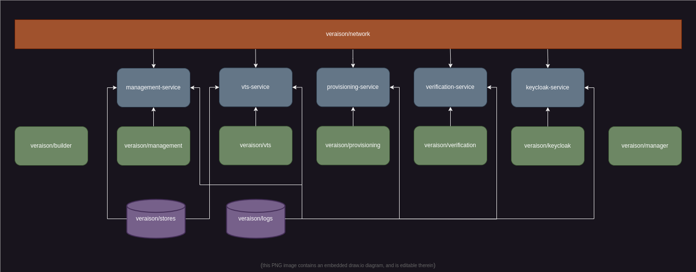

This directory contains the [Docker](https://www.docker.com/) source for the
deployment of Veraison.

## Dependencies

You will need to make sure you have `make`, `git`, `docker` (and its builder),
and `jq` installed on your system. Optionally, `tmux` can be used to
conveniently monitor output from running services. The CLI front-end relies on
`bash` shell, which should already be installed on most systems, but if not, it
would also need to be installed.

```sh
# on Ubuntu
sudo apt install bash make git docker.io docker-buildx jq tmux

# on Arch
sudo pacman -S bash make git docker docker-buildx jq tmux

# On MacOSX with Homebrew
brew install step coreutils gettext openssl sqlite3 protobuf jq
brew link --force gettext
```

> [!IMPORTANT]
> **Ubuntu users**: Make sure you have docker installed natively (via `sudo apt
> install docker.io`), and _not_ via `snap`, as the later won't have access to
> the default build contexts under `/tmp`. You could, of course, change those
> locations via the config, however we cannot guarantee that there won't be
> other issues -- if you decide to stick with `snap`, you're on your own.

### Docker set up

If you're not already set up to use Docker on your system, you will need to
make sure that it is enabled and running, and that you can access it by adding
your account to the `docker` group:

```sh
sudo systemctl enable --now docker
sudo usrmod -a -G docker $USER
```

The user group modification won't take effect until you log out and log back
in, or, alternatively, you can force in a specific shell with

```sh
newgrp docker
```

## Creating the Deployment

Once you have the pre-requisites, you can create the deployment on your local
system 

```sh
git clone https://github.com/veraison/services.git
cd services/deployments/docker

make
```

Once the deployment is created, you can set up the front end by executing

```sh
source env.bash
```

inside a bash shell. There is an equivalent `env.zsh` for zsh (other shells are
currently not supported). You can interact with the deployment via the
`veraison` command. E.g.:

```sh
veraison status
```

You should see output similar to

```
         vts: stopped
provisioning: stopped
verification: stopped
  management: stopped
    keycloak: stopped
```

To start Veraison services run:

```sh
veraison start
```

The provisioning service is now listening on port 9443, and verification
service on port 8443 (these can be changed via configuration -- see below).

Use the `-h` option to see the full list of available commands.


## Deployment Composition

The deployment exists on its own Docker network. Each of the services runs in
its own container. Service logs and VTS stores reside inside docker volumes,
independent of any container.



On the diagram above, the network is shown in orange, the volumes in purple,
the containers in blue, and the images the containers are based on in green.

In addition to the service container images, there also two images without
permanent containers. They are used to spawn ephemeral containers via `docker
run --rm`.

The `builder` image contains the Go toolchain and other tools necessary to
build Veraison. It is used to compile the service binaries and their plugins
that are then used to construct the service containers. This image is also used
to spawn debug shells.

The `manager` image is used by the `veraison` frontend to, among other things,
access the volumes where the logs and provisioned values are stored.


## Configuration

The deployment may be configured by changing the settings inside
[deployment.cfg](./deployment.cfg). See the comments inside that file for the
explanation of the individual configuration values.

> [!NOTE]
> The individual services rely on configuration inside `config.yaml.template`.
> This currently uses the `sqlite3` driver for the store backend, which limits
> request throughput and makes the deployment unsuitable for production or
> performance testing (for the latter, one can modify the template to use
> `memory` backend for the stores).

### `make` Options

You can set the following variables to influence the behaviour while executing
make targets:

`DEBUG_HOST`: sets the host name for the debug container. This is useful if you
want to substitute the debug container in place of one of the service
containers.

`DEBUG_PORT`: if set with a port number, that port on the debug container will
be forwarded to the host (debug container is run with `-p
$(DEBUG_PORT):$(DEBUG_PORT)`).

`DOCKER_BUILD_FLAGS`: additional flags to be passed to Docker when building
various images. This is passed to all image build invocations, so should only
be used for globally-applicable flags such as `--no-cache`.


## Debugging

Running `make debug` will pop up a "debug" shell inside the builder image. The
image has the build toolchain and the debugger installed, and
`/veraison/build/` directory is mapped onto the root of Veraison repo on your
host. This means you can make modifications to the source using your preferred
editor/IDE on the host, and then build and debug them in the debug shell.


### Example: debugging scheme verification plugin

For example, say you are implementing a new attestation scheme, and are running
into issues when attempting to verify your token (e.g. via an integration
tests test-case). There is not enough output in the logs to identify the issue,
and so, you'd like to set a breakpoint inside your code.

This needs to be done inside `vts-service`, as this is the component that
loads the evidence handler plugin used on the verification path.

First, assuming you have frontend set up, and the services running, (if not,
you can do so with `source env.bash; veraison start`), you will need to stop
the "production" VTS service with:

```sh
veraison stop vts
```

this will stop `vts-service` but should leave the other services running (you
can verify that by running `veraison status`).

Next, enter the debug shell:

```sh
make DEBUG_HOST=vts-service debug
```

this will pop open a `bash` shell inside the builder. The `DEBUG_HOST` argument
will set the hostname of the builder container. Here, we're setting it to the
hostname of the VTS service we just stopped, so that the provisioning and
verification services that are still running will now talk to our debug container
instead.

(Note: if you were replacing a REST service, rather than VTS, you would also
set the `DEBUG_PORT` variable to the value appropriate to the service (see
[deployment.cfg](./deployment.cfg).)

Next, navigate to the location of the VTS service executable (keeping in mind
that the root of the repo is mapped to `/veraison/build` inside the container),
and start the debugger:

```sh
# inside the debug shell:
cd /veraison/build/vts/cmd/vts-service
debug
```

The `debug` command is an alias for `dlv debug` that will make sure that the
debug executable will be built with evidence handling plugins compiled in (same
as if you ran `make SCHEME_LOADER=builtin`). This means you can set the
breakpoint inside your code directly from here, and you don't need to worry
about attaching the debugger to a separate plugin process.

(Note: the config.yaml files in service directories -- such as
`/veraison/build/vts/cmd/vts-service/config.yaml` -- that are loaded by
default, are configured for running the service directly on the build host,
outside docker. For running inside a docker container, the `config-docker.yaml`
in the same location should be used. `debug` command demonstrated above does
that, so you don't need to worry about it. However, if you want to run the
service executable directly, then you must remember to specify the appropriate
config, e.g.

```sh
# inside the debug shell:
cd /veraison/build/vts/cmd/vts-service
./vts-service --config config-docker.yaml
```
