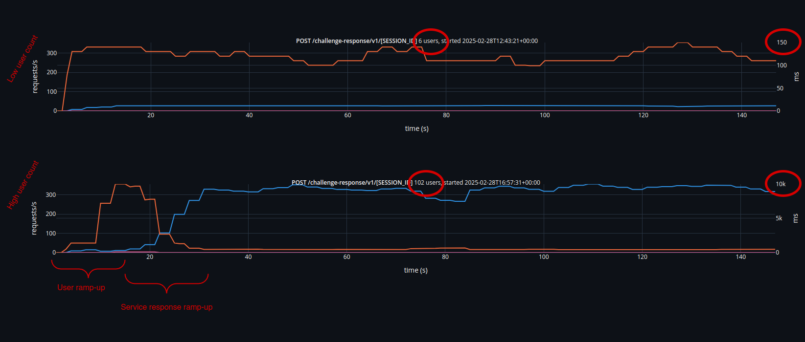

<!--
class: invert
_class: title invert
footer: © 2025 Veraison Project
-->

# AWS Deployment Load Test
2025-03-04


---

<!-- paginate: true  -->
<!-- _class: invert smallerfont smallercode -->

## Setup

- Using [Locust](https://locust.io/) for load generation
- Tasks:
    - *well-known*: get provisioning service info
      ```
      GET .well-known/veraison/provisioning
      ```
    - *provision*: provision a PSA corim
      ```
      POST /endorsement-porvisioning/v1/submit
      ```
    - *verify*: verify PSA evidence
      ```
      POST /challenge-response/v1/newSession?nonce=[NONCE]
      POST /challenge-response/v1/[SESSION_ID]
      DELETE /challenge-response/v1/[SESSION_ID]
      ```
- Measure requests/s (throughput) and 95<sup>th</sup> percentile for response time
  (latency)
- The same CoRIM/token used for all requests

<!--
"well-known" is used as a sort-of "baseline", as it requires minimal processing,
doesn't require database access, etc.

Load generator machine has 32 hardware threads. Though, CPU usage was not a
problem, so this should be irrelevant.

-->

---

## Setup

- `t2.micro` EC2 instances
- `db.t3.micro` RDS instance running PostgreSQL
- `cache.t2.micro` ElastiCache Memcached instance (used for verification
  session management)
- Deployment estimated monthly cost: ~$160/month


---

## Trial 1

- Loop all three tasks repeatedly
- Spawn progressively large number of users with each set of runs
- Clear stores between each run
- Individual run duration: 150s
- Auto-scaling groups for provisioning and verification services pinned to 3
  instances

---
<!-- _class: invert -->


---
<!-- _class: invert -->


---
<!-- _class: invert -->


---

## Timelines





<!--
There is a weird ramp-up in responses (throughput) at the start of each run
(note: it's more prominent for high user count because of its impact on
latency, but it's present for low user count as well).

At this stage, I'm not sure what causes it and whether this is an artifact of
the trial setup, network, or due to the behaviour of the service.

Unlikely to be network as excessive latencies are accompanied by DB connection
errors, indicating pressure on the service.
-->


---

## Observations

- Throughput seems to flatten out at just over 400 requests/s
- A large initial spike in latency for higher user counts
- A small number of failed requests at higher user counts during verification

  | users | method | location                            | failures | total requests |
  |-------|--------|-------------------------------------|----------|----------------|
  | 86    | POST   | /challenge-response/v1/[SESSION_ID] | 36       | 42081          |
  | 102   | POST   | /challenge-response/v1/[SESSION_ID] | 31       | 42343          |

  ```
  ERROR   vts     failed to connect to `user=veraison database=veraison`:
          10.1.3.77:5432 (veraison-support-rdsinstance-jlqj0tz7na5h.cdp1uev75r4z.eu-west-1.rds.amazonaws.com): server error: FATAL: sorry, too many clients already (SQLSTATE 53300)
          10.1.3.77:5432 (veraison-support-rdsinstance-jlqj0tz7na5h.cdp1uev75r4z.eu-west-1.rds.amazonaws.com): server error: FATAL: sorry, too many clients already (SQLSTATE 53300)
  ERROR   vts     failed to connect to `user=veraison database=veraison`:
          10.1.3.77:5432 (veraison-support-rdsinstance-jlqj0tz7na5h.cdp1uev75r4z.eu-west-1.rds.amazonaws.com): server error: FATAL: remaining connection slots are reserved for roles with the SUPERUSER attribute (SQLSTATE 53300)
          10.1.3.77:5432 (veraison-support-rdsinstance-jlqj0tz7na5h.cdp1uev75r4z.eu-west-1.rds.amazonaws.com): server error: FATAL: no pg_hba.conf entry for host "10.1.2.198", user "veraison", database "veraison", no encryption (SQLSTATE 28000)
  ```

<!--
This shows the only two instances of errors happening.

Interestingly, no failures  in the run with 94 users. Looking at the timelines,
the max latency for that one did not go above ~2sec, where as latency for the
two erring runs was ~12sec and ~10sec respectively.
-->

---

## Trial 2

- Measure the impact of additional services instances
- Same as <em>Trial 1</em>, except
- Auto-scaling groups for provisioning and verification services pinned to 1
  instance

---
<!-- _class: invert -->


---
<!-- _class: invert -->


---
<!-- _class: invert -->


---

## Observations

- Additional instances have a positive impact on throughput
  - Especially pronounced in verification (close to double at higher user counts)
- Additional instances have a <em>negative</em> impact on latency
  - Should be noted, this is at 95<sup>th</sup> percentile. Median (i.e.
    "expected" latency hovers around 100ms in all cases)

<!--

Note really sure why latency is impacted negatively.

If I had to speculate, I would guess that there is more contention on DB
access.

-->

---

## Trial 3

- Measure the impact of the number of records in the store (its "weight")
- Parallel users fixed at 15
- Run `provision` task followed by `verify` task
- For 6 iterations
- Number of entries in the K-V store (endorsements + trust anchors) is taken at
  the end of each iteration
- Stores are <em>NOT</em> cleared between tasks or between iterations
- Individual run duration: 150s
- Auto-scaling groups for provisioning and verification services pinned to 3
  instances

<!--
The `provision` task loads up the store with a large number of records.

Even though we're provisioning the same CoRIM each time, the K-V store allows
duplicate keys, so each provisioning call adds entries to the store.

-->

---
<!-- _class: invert -->


---

## Observations

- Store weight has no impact on provisioning
- <em>Severe</em> impact on verification

<!--
This is pretty much as expected.

Provisioning adds entries to the DB and so is agnostic of the number of
existing entries.

Verification runs queries to identify relevant entries. The more entries, the
longer queries take.

Also, in this case, the more entries will be returned as a result, therefore
the longer the resulting attestation will take. This seems unrealistic (it is the
consequence of us provisioning the same CoRIM over and over). So, in a real
deployment, the impact is expected to be less.
-->

---

## Trial 4

- Evaluates auto-scaling
- A singe  run with
  - 50 users
  - 900 second (15 minute) duration
  - Just the `verify` task
  - Auto-scaling between 1 and 3 instances

---
<!-- _class: invert -->


- New instances take >5mins to spin up
- There is a failed requests spike as an instance comes online
  ```
  2025-03-03 09:35:33.709000+00:00 i-0a1ec1087f1abe77a ERROR	api-handler	rpc error: code = Unavailable desc = connection error: desc = "transport: Error while dialing: dial tcp 127.0.0.1:50051: connect: connection refused"
  ```

<!--

AWS has a solution to the slow onstance spin up time, which is to maintain an
idle pool. This is, currently, not configured in the deployment.

The failure appers to be due to VTS not having come on line yet (loading
plugins..?)

Possible solution: need a dedicated heath check endpoint that verifies that the
service is fully operational. Maybe can use .well-known that that..?

-->

---

## Conclusion

- Need a health check indicator -- could use .well-known?
    - This is not currently possible for provisioning due to auth.
- DB seems to be the bottleneck (especially for verification)
    - Implementing a cache may help?
    - Duplicate detection for provisioning?
    - Archiving for the K-V store?

<!--

Cache efficacy would be very scheme-dependent. E.g. for CCA

- it would help for endorsements, as they're keyed on implementation ID which
  is likely to be shared by non-trivial number of attesters
- Wont be of much help for trust anchors -- as those are keyed on instance ID,
  unique per-attester.

Duplicate detection for provisioning: Avoid storing identical entires.

Archiving: avoid storing entries that are no longer relevant as they contibute
to query costs. Problem: how to identify what is safe to archive..? (in
practive, probably leave to user)

-->

---
<!-- _class: invert title -->

# Thank You

<!--  -->
<!-- vim: set spell tw=79: -->
