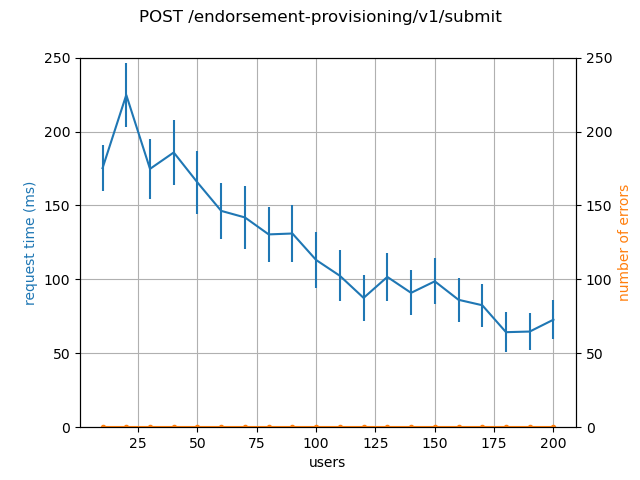
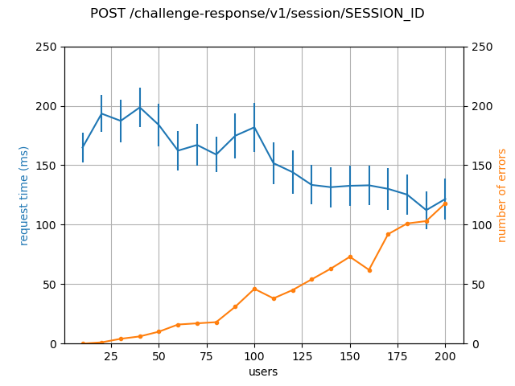
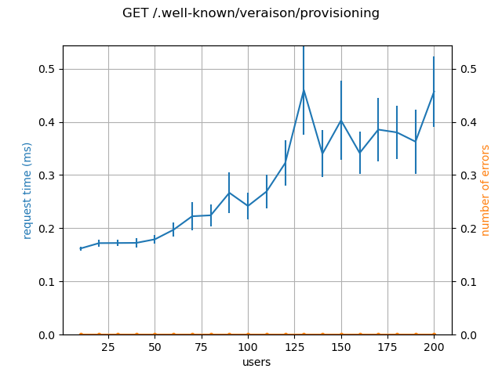
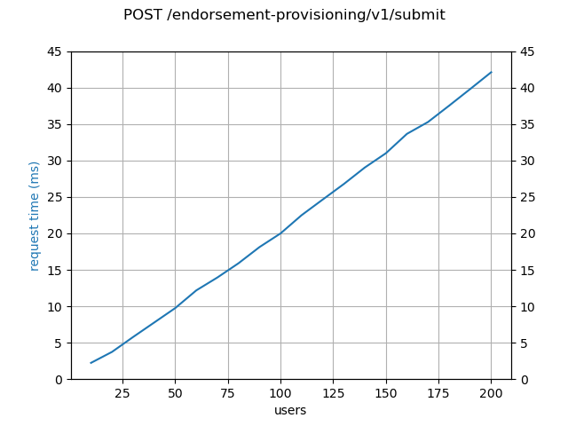
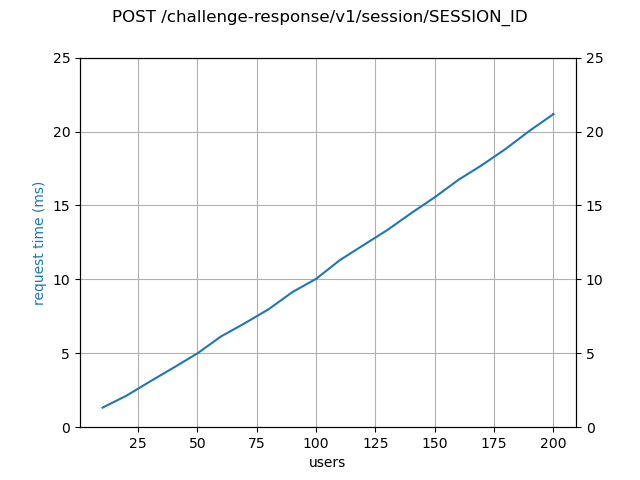
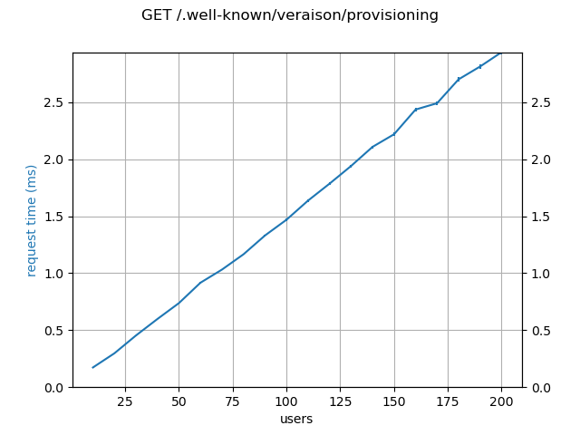

# Veraison perf evaluation 2023-05-03

## Method

- Loads are generated using [`locust`](https://locust.io/), with a duration of 30 seconds.
- The same static payloads (PSA evidence and endorsements taken from
  integration tests) are used for each request.
- Request handling times extracted from `gin` logs. Error bars on request times
  are the 95% conf. int.
- Error counts are for responses with statuses other than `2xx`.
- Execution and analysis scripts under `perf/` inside `services` repo
  (currently only `setrofim-perf` branch).

---

## Results

### Initial

#### Provisioning



#### Verification



#### Well Known (control)




There is a lot of weirdness happening, but the primary observation is the
increase in the number of errors as the load increases. The Errors are all of
the form

```
api-handler	rpc error: code = Unknown desc = database is locked
api	problem encountered	{"title": "Internal Server Error", "detail": "error encountered while processing evidence"}
```

Looking at the VTS logs, the root cause appears to be

```
 {"detail":["signature verification failed: verification error","verification error"],"detail-type":"error","error":"bad evidence"}
```

Which suggested that the issue is with the sqlite3 database, which is
used as the backend for the K-V store.

### Memory Backend

To confirm this, the tests were re-run against a deployment configured to use
the `memory` backend for the K-V store (i.e. stored items are kept in memory
and are not persisted to disk).

#### Provisioning



#### Verification



#### Well Known (control)



This produces the expected linear progression as the number of active users
increases.

---

## Conclusion

- The K-V store is the bottleneck for most operations.
- Since the verification path performs more store accesses per request than the
  provisioning path, it is more heavily impacted.
- sqlite3 is wholly unsuitable as the K-V store backend in a production
  setting.
- The deployment implementation and configuration is likely to be more
  impactful on service performance than the actual Veraison code.
  - To put another way: we do not appear to have any major perf issues in our
    code that require immediately addressing; optimisation efforts are best
    spent on deployment configuration.
