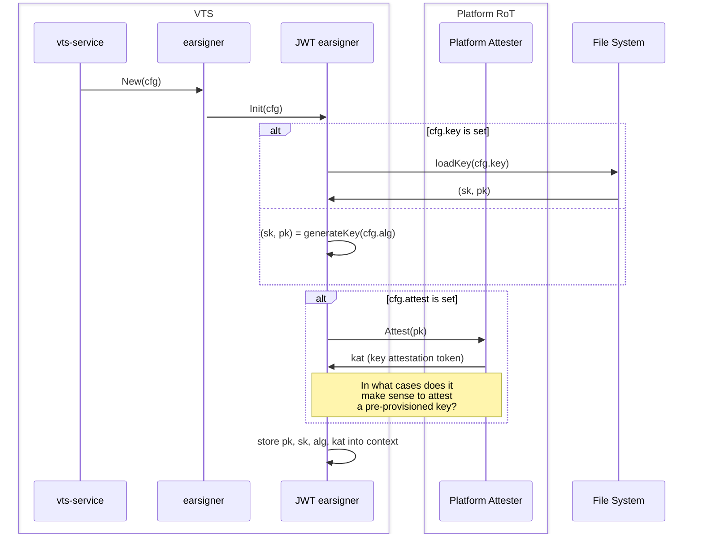
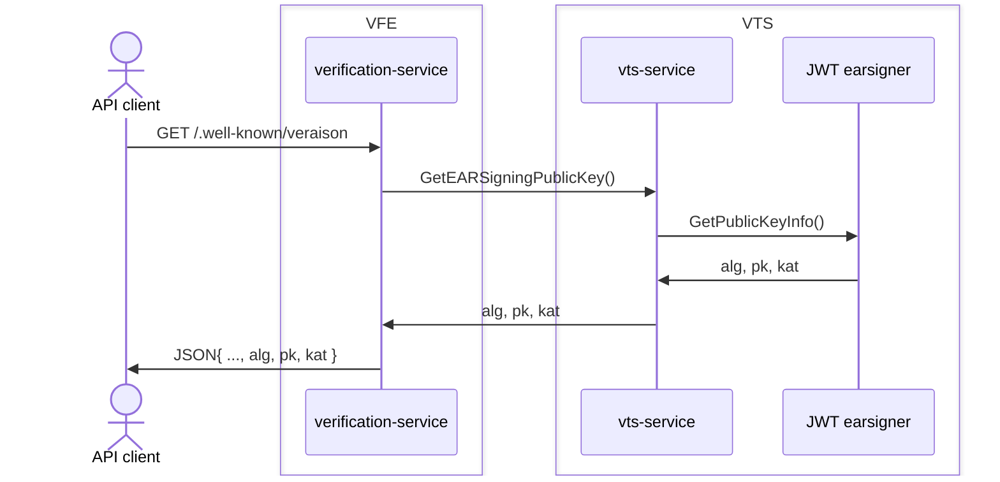
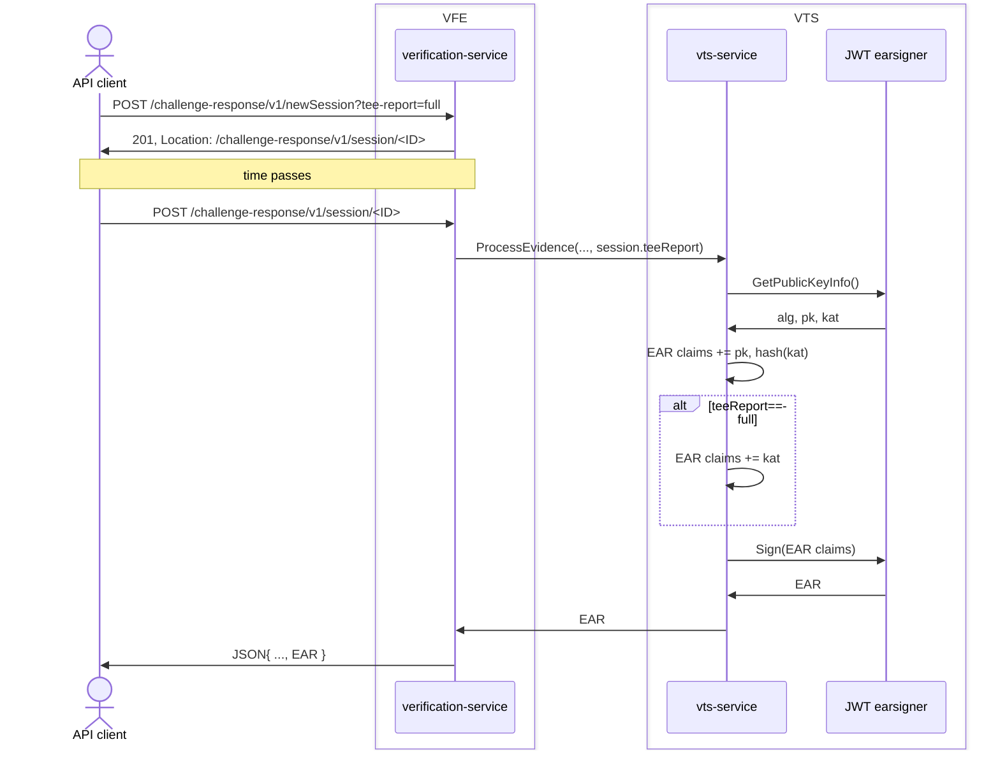

## Configuration

- `ear-signer`: stanza containing the configuration details about the attestation
  result signing process.  The supported directives are:
  - `alg`: the [JWS algorithm](https://www.iana.org/assignments/jose/jose.xhtml#web-signature-encryption-algorithms)
    used for signing, e.g.: `ES256`, `RS512`.
  - `key` (optional): file containing the private key to be used with `alg`.
    The key is in [JWK format](https://datatracker.ietf.org/doc/rfc7517/).
    A new key-pair is generated on-the-fly if the `key` directive is missing.
  - `attester` (optional): when VTS runs in a TEE (e.g., an AWS Nitro enclave),
    this directive specifies which attester is to be used to produce evidence
    for the EAR signing key.  The supported attesters are: `nitro`.

## Startup

## Run-time via `.well-known/veraison`

## Run-time via `challenge-response/v1/newSession`

